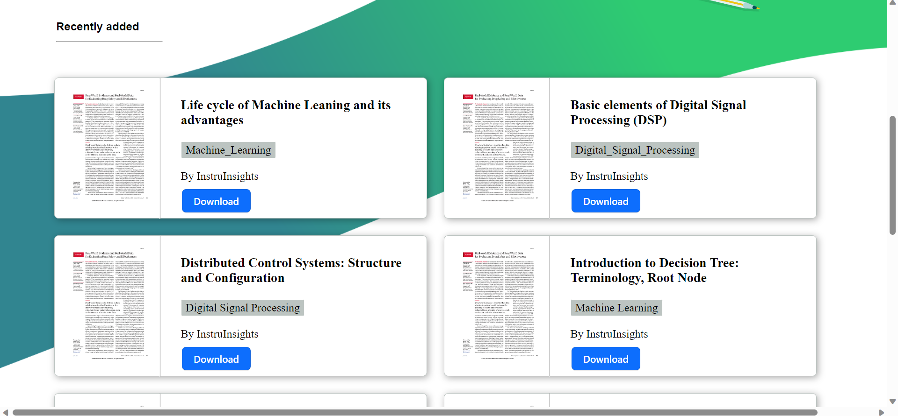
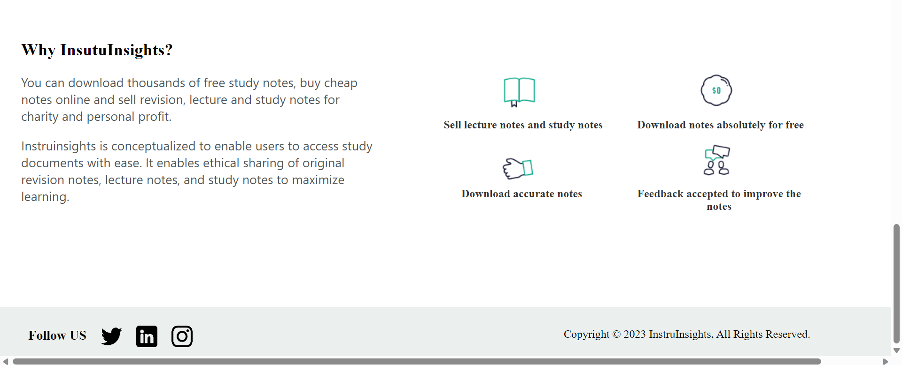
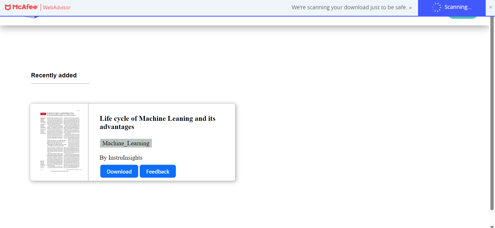
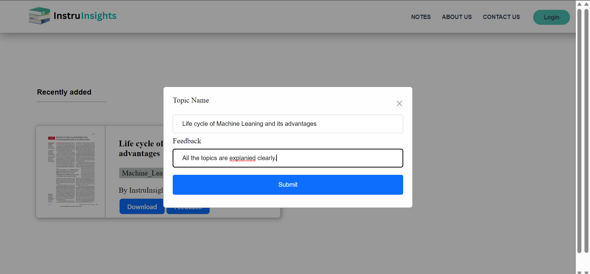

Hello!  
• This is a notes-sharing website students can upload, download, and share study notes and important study documents.  

## <b> Skills</b>
 

 

 

    
## <picture></picture> About Project
  1 - When We open the Website it will look like this.  
    
  
    
   
2 - Then we have recently added section where the latest added notes are seen.  
    
  
    
   
3 -  The bottom of the page looks like this.  
    
  
    

3 -  There is a view subject button after clicking it where we can see all added subjects.  
    
  
    

4 - We can download the notes and give feedback very easily.  
    

  

 
  <b> Thank You ❤️</b> 

